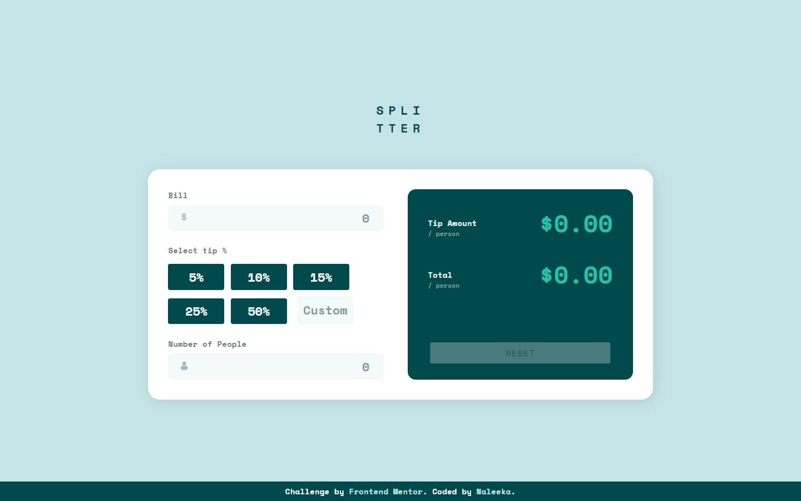
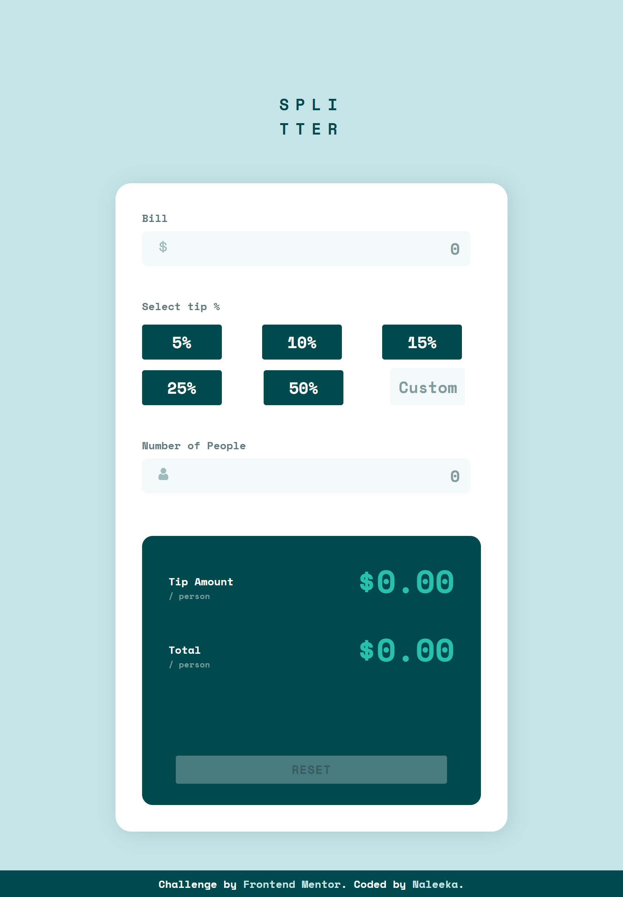
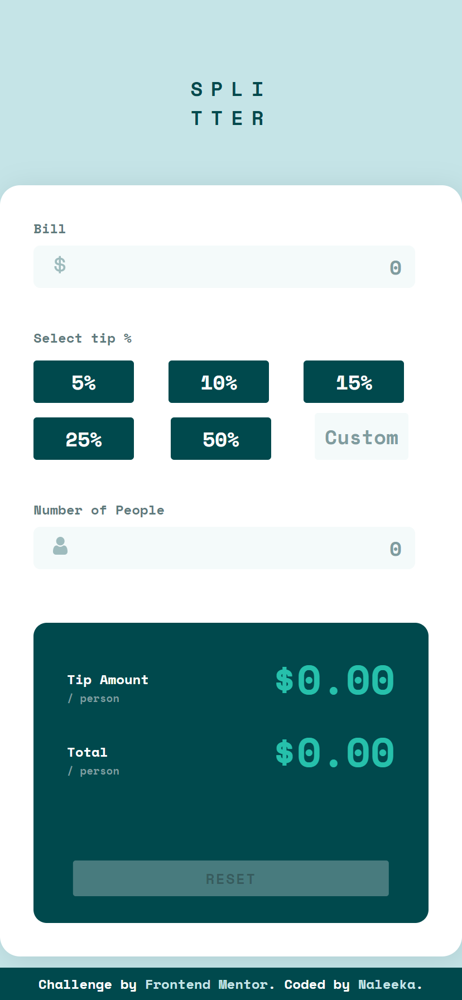

# Frontend Mentor - Tip calculator app solution

This is a solution to the [Tip calculator app challenge on Frontend Mentor](https://www.frontendmentor.io/challenges/tip-calculator-app-ugJNGbJUX). Frontend Mentor challenges help you improve your coding skills by building realistic projects.

## Table of contents

- [Overview](#overview)
  - [The challenge](#the-challenge)
  - [Screenshot](#screenshot)
  - [Links](#links)
  - [Built with](#built-with)
  - [Continued development](#continued-development)
- [Author](#author)

## Overview

### The challenge

Users should be able to:

- View the optimal layout for the app depending on their device's screen size
- See hover states for all interactive elements on the page
- Calculate the correct tip and total cost of the bill per person

### Screenshot

Desktop View 👇

Tablet View 👇

Mobile View 👇

### Links

- Solution URL: [SOLUTION](https://github.com/Naleeka/naleeka.github.io/tree/main/tip-calculator-app-main)

- Live Site URL: [LIVE SERVER](https://naleeka.github.io/tip-calculator-app-main/)

### Built with

- Semantic HTML5 markup
- CSS custom properties
- Flexbox
- Desktop-first workflow

## Author

- Frontend Mentor - [@Naleeka](https://www.frontendmentor.io/profile/Naleeka)
- Twitter - [@\_Naleeka](https://www.twitter.com/_Naleeka)
